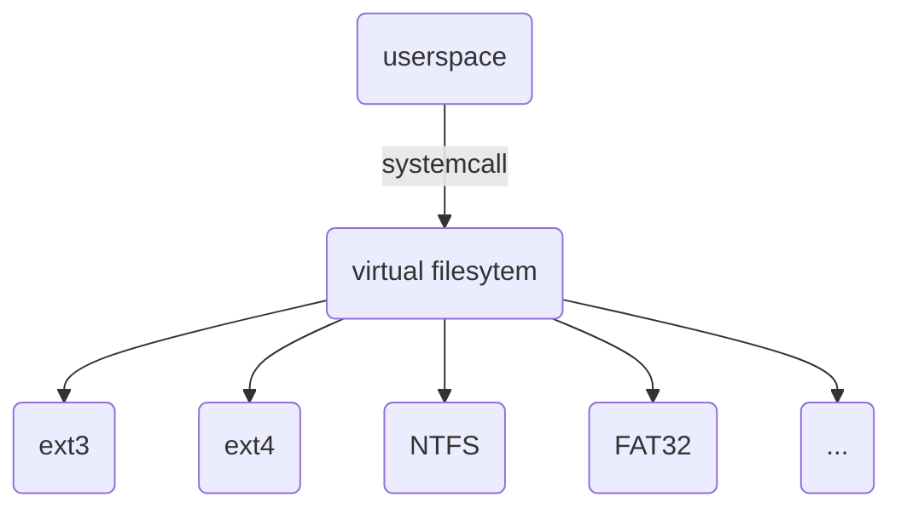

# Filesystem M1-S4 🗃️

## What is a filesystem?
A file system is a method an operating system uses to store, organize, and manage files and directories on a storage device.
## Why do we need filesystem?
* Essential for managing and organizing how data is stored, accessed, and managed on storage devices.
* abstracts storage devices and the way the user interacts with the storage.
* mapping between different formats.
```mermaid
flowchart LR

    subgraph Userspace

        A[hello_world.txt]

    end

    subgraph Kernel

        B[filesystem stack]

    end

    subgraph Hardware

        H[1010100010]

    end

    A --> B

    B --> H
```


## High-Level View 


## What's a virtual filesystem and why's it needed ?
 A virtual filesystem is an abstraction layer between the user and the real filesystems by mounting on it the real fs.
#### Benefits of **VFS**
* abstracts the different types of file systems.
* makes the kernel support different types.
* add filesystems in runtime.

## What's mount operation?
mounting refers to the process of attaching a specific real filesystem to a particular directory so userspace can access this storage.
```text
Analogy:
Imagine a library (VFS) with different sections (mount points). You can bring in additional bookshelves (real filesystems) and place them in designated areas (mount points) within the library
```

## What's a file system table and Why does vfs needs it?
VFS owns an information table for **Tracking Mounted Filesystems** which includes details like:
- **Mount Point:** The directory where the filesystem is accessible in userspace.
- **Device driver:** The physical storage device or device driver location.
- **Filesystem Type: (e.g., ext4, NTFS, FAT32).


***in a userspace when the mount point is used, the vfs redirects to its device driver which will access the storage device***

## What if vfs didn't exist in Linux?
Linux would likely only support a single filesystem format like ext4, if ext4 supports strings only the userspace (applications) would be working only with text files.

>[!NOTE]
>* There should be at least one filesystem which is usually the root filesystem so the kernel boots correctly
>* without root filesystem, userspace will not exist. (kernel panic occurs)

```mermaid
timeline

    title Boot Process 

  

        Power On: The computer powers on, and the BIOS (or UEFI) takes control.

  

        Bootloader Execution: The BIOS/UEFI hands control to the bootloader.

  

        Kernel Loading: The bootloader locates and loads the Linux kernel.
  

        Root Filesystem Identification: The bootloader looks for root fs.

  

        Kernel Initialization: The kernel initializes itself and mounts the root filesystem.

  

        System Startup: Once the root filesystem is mounted, the kernel locates and executes the init....
```

## Commands 


