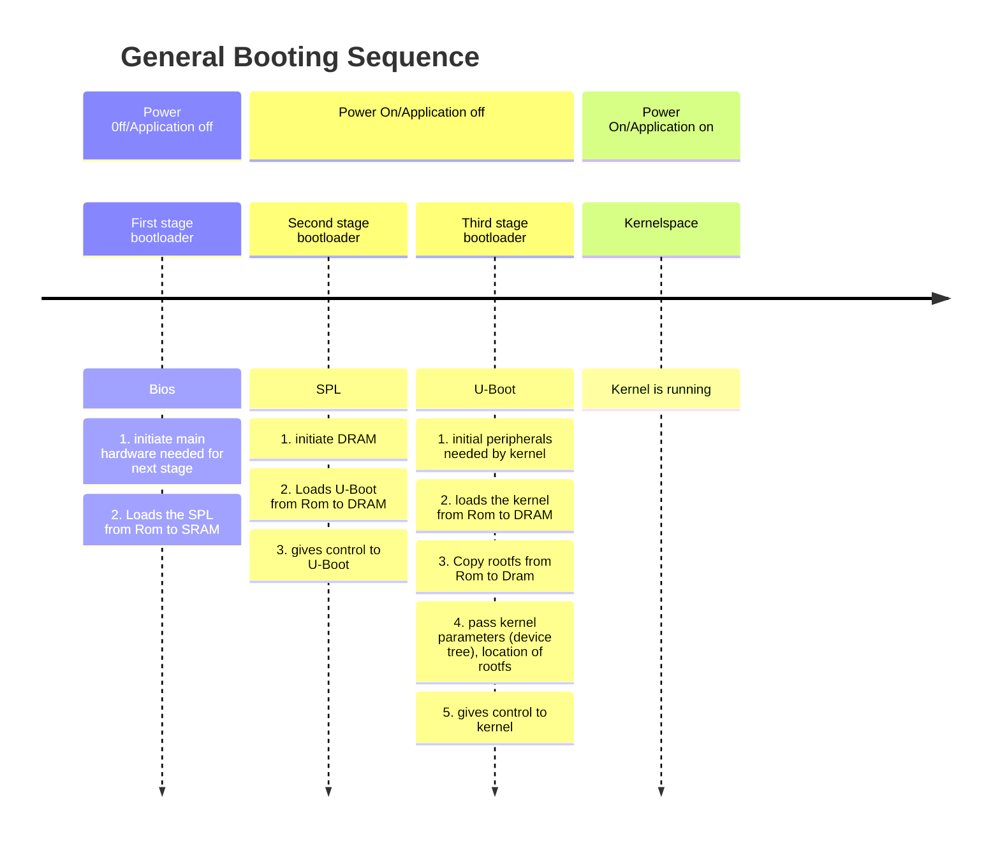

    
   
   # Bootloader Customization
      
 >[!NOTE]
 >This is a simplified version of the booting sequence, it differs depending on the architecture, the hardware and linux distributions.
___
# Table of Contents

- [Explaining Linux General Booting Sequence](#explaining-linux-general-booting-sequence)
	- [First Stage BL](#first-stage-bl--bios-basics-inputoutput-system)
	- [Second Stage BL](#second-stage-bl--spl-secondary-program-loader)
	- [Third stage BL](#third-stage-bl-u-boot-unified-bootloader)
- [U-BOOT](#u-boot-what-matters-the-most-in-embedded-linux)
	- [Steps for Bootloader Customization 🏗️](#steps-for-bootloader-customization-)
- [What's a device tree?](#whats-a-device-tree)
- [Summary 🚀](#summary-)
- [References](#references)

___
# Explaining Linux General Booting Sequence 


## First Stage BL : BIOS (Basics Input/Output System)
- The bios is a firmware that's responsible for initiating main hardware components."_initialize just enough hardware to load the_ **_Second-Stage Loader_**”
- The bios runs from the ROM.
- The bios performs power-on self test (**POST**) on the hardware and on the system
- It's main functionality is to check the hardware and make sure they're functioning correctly before giving control to the second stage bootloader.  
- Loads the SPL from ROM to SRAM.
- Small in size
- Machine & platform dependent
  


## Second Stage BL : SPL (Secondary Program Loader)
- The SPL initiates the DRAM and the DRAM controller.
- The SPL locates the third stage bootloader and loads it from Rom to DRAM.
- Gives control to the third stage bootloader.
  


## Third stage BL: U-boot (Unified Bootloader)
- Initiate the hardware needed by kernel to boot correctly.
- Locates the kernel and loads it to DRAM.
- Copy root filesystem from Rom to DRAM.
- Pass device tree to kernel.
- gives control to kernel.
  


# U-BOOT (What matters the most in embedded linux)
## Steps for Bootloader Customization 🏗️
1. Download source code from repository.
2. Configure the U-boot depending on Architecture, Board or SOC.
3. Build it using cross toolchain.
4. Flash Bootloader on target or qemu.

### 1. Download source code 
use `git clone https://github.com/u-boot/u-boot`


### 2.  Configure the U-boot

``` bash
cd u-boot
ls
cd configs
#copy the defauly configuration you need ( in my case it's raspi3)
make rpi_3_deconfig
```


### 3. Build the U-Boot
`make CROSS_COMPILE=<prefix_toolchain>`
U-boot is for debugging purposes .
U-boot.bin is the binary used.


### 4. Testing using Qemu

```bash
qemu-system-aarch64.exe \
    -M raspi3b \
    -cpu cortex-a72 \
    -append "rw earlyprintk loglevel=8 console=ttyAMA0,115200" \
    -kernel u-boot.bin \
    -m 1G -smp 4 \
    -dtb /home/reema/Downloads/rpi3-b.dtb \
    -serial stdio \
    -usb -device usb-mouse -device usb-kbd \
        -device usb-net,netdev=net0 \
        -netdev user,id=net0,hostfwd=tcp::5555-:22

```


# What's a device tree? 
- The device tree is a hierarchical data structure that describes the hardware configuration of a system.
- The Kernel needs this information to initiates the drivers and configure device parameters.
- The device tree is represented as a tree of nodes, where each node corresponds to a device in the system. Nodes are connected through parent-child relationships, with the root node representing the entire system.
- The device tree is stored in a binary format that is typically compiled from a human-readable source file (usually with a .dts or .dtsi extension) using the Device Tree Compiler (DTC) tool.
- The device tree is loaded into memory by the bootloader and passed to the kernel as a pointer to a data structure that describes the location and size of the tree in memory.

```bash
# from source --> binary
dtc <device_tree>.dts -o <device_tree>.dtb
# from binary --> source
dtc -I dtb -O dts <device_tree>.dtb -o <device_tree>.dts
```

# Summary 🚀

# References
 > - https://medium.com/@tunacici7/first-stage-loaders-bios-u-efi-iboot1-u-boot-spl-5c0bee7feb15
 > - https://www.linkedin.com/pulse/device-trees-embedded-linux-keroles-khalil/
 > - https://www.freecodecamp.org/news/the-linux-booting-process-6-steps-described-in-detail/
