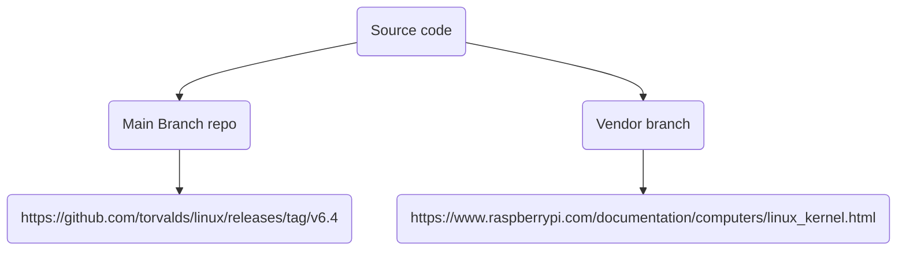

# Kernel Customization


# Table of Contents 

- [Steps for Kernel Customization 📃](#steps-for-kernel-customization-)
- [Getting Started 🚀](#getting-started-)
  
- [Steps using Main Branch Repository 🏗️](#steps-using-main-branch-repository-)
	- [1. Downloading Kernel Source code](#1-downloading-kernel-source-code)
	- [2. Configure Kernel](#2-configure-kernel)
	- [3. Build Kernel](#3-build-kernel)
- [Steps using vendor path🏗️](#steps-using-vendor-path)
	

# Steps for Kernel Customization 📃
1. Downloading kernel source code either from repository or from vendor. (uncustomized kernel).
2. Configure the kernel according to your target specifications using menuconfig. (customized kernel)`
3. Build Kernel using the cross platform toolchain. (image)
4. Booting kernel to the target or qemu.
# Getting Started 🚀


# Steps using Main Branch Repository 🏗️
##  1. Downloading Kernel Source code  

you should use the same version or older as your toolchain kernel header files version.
```bash
#Navigate to your crosstool directory and display the configuration.
cd crosstool-ng/
bin/ct-ng show-config
```


go to the repo and to the tags to choose the right version of the source code


use `tar xf <compressed source code> --directory <directory__path>` to extract the file.


## 2. Configure Kernel


- The menuconfig reads the Kconfig (which is the default configuration of every directory in the kernel source). if a directory have Kconfig then this directory can be customized.
  
use `make ARCH=<architectutre_target> CROSS_COMPILE=<toolchain_prefix> menuconfig`


***kconfig file is a hierarchical file based on " key value pair " ,  all of these files in the Kconfig can be configured***


- after  menuconfig reads the Kconfig of every directory, you can change the configurations according to the specifications of your board or the requirements of your project.

-  then load configuration to generate .config file by clicking `save`


>[!NOTE]
why choose the architecture configuration for the kernel customization❓  
>The kernel repo itself doesn't directly contain board-specific or Soc-specific configurations and specifying the architecture provides a more general and flexible approach to kernel configuration.

## 3. Build Kernel

When Kbuild customized the kernel source code according to the .config file, it's time to build it to create the **image** that must be compatible with the boot-loader.

- use `make ARCH=arm64 CROSS_COMPILE=<prefix_of_toolchain> <target> `
- use `make ARCH=arm64 CROSS_COMPILE=<prefix_of_toolchain> ` for vmlinux
- use `make ARCH=arm64 CROSS_COMPILE=<prefix_of_toolchain> Image` for zimage
- use `make ARCH=arm64 CROSS_COMPILE=<prefix_of_toolchain> LOADADDR=<ADDRESS> uImage` for uImage


### what `<target>` should be used when generating the image ❓

### the `image` must be boot-loader compatible . 
### The four types of `<target>` :
### vmlinux

- Uncompressed elf file.
- Primarily used for debugging purposes.
- Not directly bootable.

### zImage

- Compressed version of vmlinux .
- Suitable for older bootloaders with limited memory.
- Primarily used for x86 architectures.

### uImage

- Compressed kernel image with a header containing information about the image, such as compression type, image size, and load address.
- More flexible than zImage and can be used on various architectures.
- Commonly used with modern bootloaders like U-Boot.

### distclean
- not an image but its a command used in the build process.
- it removes configuration, generated config files and resets the build environment to start from scratch.


____
# Steps using vendor path 🏗️

It's the straightforward path because of the vendor documentation.
[vendor steps to cross compiler the kernel and build it](https://www.raspberrypi.com/documentation/computers/linux_kernel.html#cross-compile-the-kernel)

steps for raspi3+ arm64  
```bash
sudo apt install git
git clone --depth=1 --branch <branch> https://github.com/raspberrypi/linux
```
branch names from the vendor git repo


```bash
sudo apt install bc bison flex libssl-dev make libc6-dev libncurses5-dev
cd linux
KERNEL=kernel8
make ARCH=arm64 CROSS_COMPILE=aarch64-linux-gnu- bcm2711_defconfig
make ARCH=arm64 CROSS_COMPILE=aarch64-linux-gnu- Image modules dtbs
```

## it's done without configuring anything in the kernel because it's already customized for our board 😼


