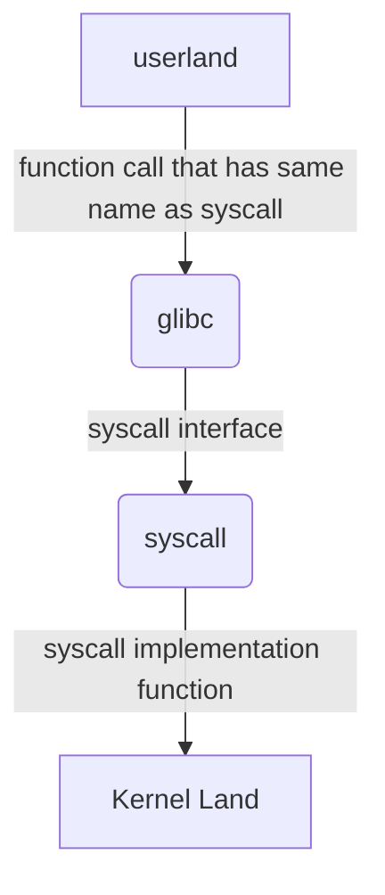

# Session two 2️⃣
## System Call Introduction 

  ### what is a system call?💡

  System call provides the **services** of the linux kernel, in another definition its a **software interrupt**. its also the **interface** provided for us to use a service made available by os.

  ### how does it work?💡

  When a userland request a service from kernel space, meaning that if a program needs to access a specific resource it has to go thru the kernel by syscall first. this service is the system call.

### Example of System Call

 ### Steps 🪜
- invoke a function or a service from the kernel by using glibc 
- save context of userspace 
- context switch from userspace to kernelspace
- search for syscall in [syscall table](https://filippo.io/linux-syscall-table/)
- call function in the kernel
- do operation
- return result
  | status | return value |
  | --------- | -------- |
  | failure | cause of failure or any value except 0 |
  | success | content or 0 or null |
- restore context of userspace


### Conclusion🎆
 ```mermaid
graph LR;
    A[user mode] <--> |syscall| B(kernel mode)
```


>[!note]
>* glibc is a wrapper library that has *wrapper functions*, one function of the glibc has many syscalls <sub> if i want to do the direct way to the kernel i have to use all these syscalls. examples of using a glibc and all the syscalls that happen in one of glibc function </sub>
>
>* glibc can be customized to another c standard library like musl
>* no file interactions the syscall interacts directly with the kernel
>* we can do **monitoring** by using `strace` command and overview using `strace -c` where we can see the failure of any syscalls
>* good source [watch this](https://www.youtube.com/watch?v=lhToWeuWWfw)


    
    
    
  
