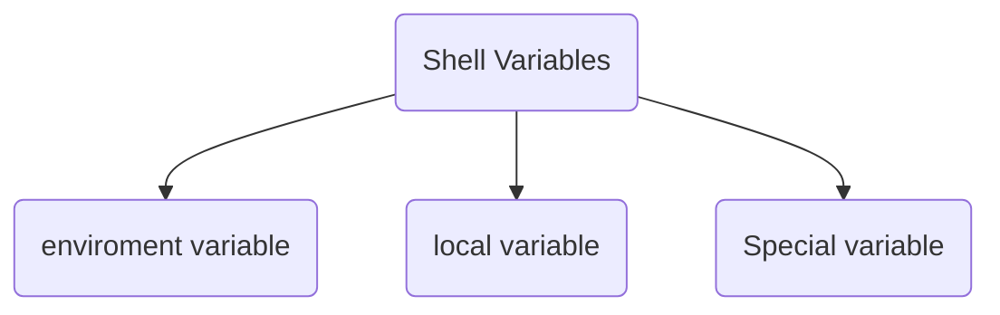
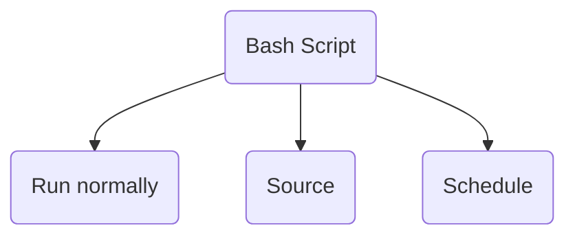

# Bash Scripting Language🐚
## 🏗️ Basic Structure of a Bash Script
1. shebang
2. inputs
3. outputs
4. types of variables
5. check conditions
6. functions
___
### 💥 Shebang
Shebang (#!): A seqeunce of character followed by the path of interpreter which indicates which interpreter which be used.

___
### ➡️ Inputs
1. Before you run the script
   - Accessing posiitonal parameters inside the script:
     - use `$0` for script's name
     - use `$1` for the first argument passed to script, `$2` for the second argument passed to script, `$...
     - use `$#` to get the numbers of arguments
     - use `$@` to get all arguments

2. After you run the script
   - use `read <variable_name>` to hold the script and wait for an input

___
### ⚙️ Types of variables

1. local variable operations:
   - declare a variable
   
   - assign a varaible
   
   - access a variable
   - delete a variable
   

2. Enviroment Variable operations:
   - declare a variable: two ways
     
   - change value
     
   - access a variable
   - delete a variable
   - print all variable
   

3. Special Variables operations:
   - use `$$` to get process id of current shell
   - use `$?` to get the status of the last command
     

___
### 🧮 Arthimetic Operation
you can use `+` , `-` , `/` and `*`.

___
### 🛂 Flow control/check condition
a. On Numbers
you can use `>`,`<`,`>=`,`<=`,`==` and `!=` for comparsion and `&&`, `||` and `!` for logical operations.

b. On Strings
you can use `=`, `!=`,`-z` for empty strings and `-n` for non-empty strings.

c. On Files/Directoriories
1. check if file/directory exists
2. check if file exist and not empty
3. check file/directory owner
4. check group of file/directory

___

### ⬅️ Outputs
1. Exit status
   
3. Printf statements
___   

## Ways to run a Bash Script?

