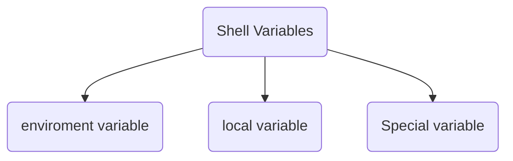
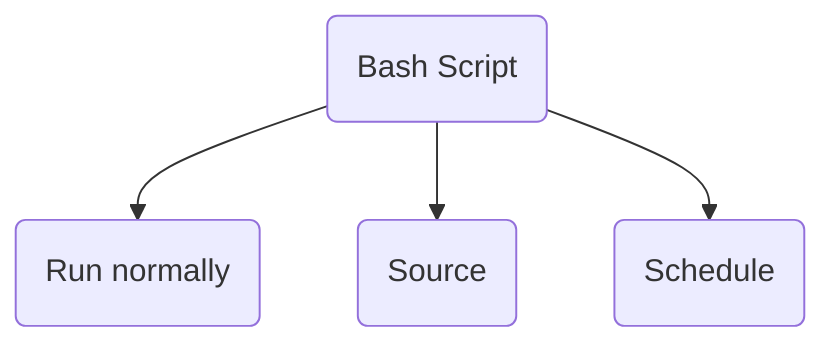

# Bash Scripting Language🐚
## 🏗️ Basic Structure of a Bash Script
1. shebang
2. inputs
3. outputs
4. types of variables
5. check conditions
6. functions
### 💥 Shebang
Shebang (#!): A seqeunce of character followed by the path of interpreter which indicates which interpreter which be used.

### ➡️ Inputs
1. Before you run the script
   - Accessing posiitonal parameters inside the script:
     - use `$0` for script's name
     - use `$1` for the first argument passed to script, `$2` for the second argument passed to script, `$...
     - use `$#` to get the numbers of arguments
     - use `$@` to get all arguments

2. After you run the script
   - use `read <variable_name>` to hold the script and wait for an input

### ⚙️ Types of variables

1. local variable

## Ways to run a Bash Script?

